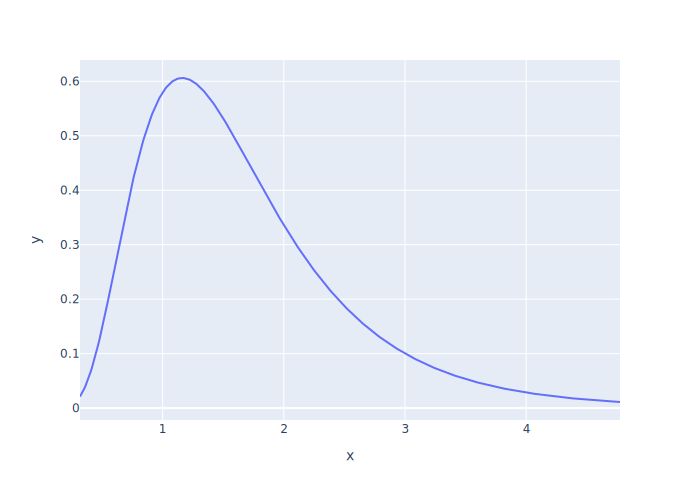

# Multiple Actors

-   FIXME

## One Manager, One Developer, Fixed Times

-   Use `simpy.Store` to model a [job queue](g:job-queue)
    -   First-in, first-out
    -   Infinite capacity (for now)
-   A generic `Worker` saves constructor arguments and calls `.run` to run

```{.python data-file=m1_d1_fixed.py}
class Worker:
    def __init__(self, env, log, queue):
        self.env = env
        self.log = log
        self.queue = queue
        self.env.process(self.run())
```

-   A `Manager` puts jobs in the queue
    -   Use `count` to generate a sequence of numbers to identify jobs
    -   Append a record to the log (instrumentation not sampling)
    -   For now, wait 4 ticks between each job
-   Most important part is `queue.put(job)`
    -   Creates an object asking SimPy to add something to the queue
    -   Process must `yield` this object to return control to the framework
    -   So that the framework can block this process if the queue is full (finite capacity)
    -   And run other processes that might be waiting

```{.python data-file=m1_d1_fixed.py}
from itertools import count

class Manager(Worker):
    def __init__(self, env, log, queue):
        super().__init__(env, log, queue)
        self.jobs = count()

    def run(self):
        while True:
            job = next(self.jobs)
            self.log.append(
                {"id": "manager", "time": self.env.rnow, "job": job, "event": "create"}
            )
            yield self.queue.put(job)
            yield self.env.timeout(self.t_job_arrival())

    def t_job_arrival(self):
        return 4
```

-   `Programmer` takes jobs from the queue and works on them
    -   Again, must `yield` the object created by `queue.get()` so that SimPy can handle scheduling
    -   Work for a fixed time (we'll change this in a moment)

```{.python data-file=m1_d1_fixed.py}
class Programmer(Worker):
    def run(self):
        while True:
            job = yield self.queue.get()
            job_length = self.t_job_length()
            self.log.append(
                {"id": "programmer", "time": self.env.rnow, "job": job, "event": "start",}
            )
            yield self.env.timeout(job_length)
            self.log.append(
                {"id": "programmer", "time": self.env.rnow, "job": job, "event": "end"}
            )

    def t_job_length(self):
        return 3
```

-   Output is predictable (fixed times) and therefore easy (or easier) to check

```{.out data-file=m1_d1_fixed.out}
[
  {"id": "manager", "time": 0, "job": 0, "event": "create"},
  {"id": "programmer", "time": 0, "job": 0, "event": "start"},
  {"id": "programmer", "time": 3, "job": 0, "event": "end"},
  {"id": "manager", "time": 4, "job": 1, "event": "create"},
  {"id": "programmer", "time": 4, "job": 1, "event": "start"},
  {"id": "programmer", "time": 7, "job": 1, "event": "end"},
  {"id": "manager", "time": 8, "job": 2, "event": "create"},
  {"id": "programmer", "time": 8, "job": 2, "event": "start"}
]
```

FIXME: diagram

## Random Times

-   Assume probability of manager generating a new job in any instant is fixed
    -   I.e., doesn't depend on how long since the last job was generated
-   If the arrival rate (jobs per tick) is λ,
    the time until the next job is an [exponential](g:random-exponential) random variable
    with mean 1/λ

<div class="center">
  
</div>

-   Use a [log-normal](g:random-log-normal) random variable to model job lengths
    -   Most jobs are short but there are a few outliers
    -   If parameters are μ and σ, [median](g:median) is e<sup>μ</sup>

<div class="center">
  
</div>
