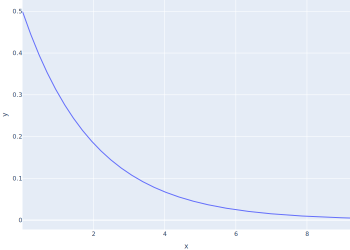
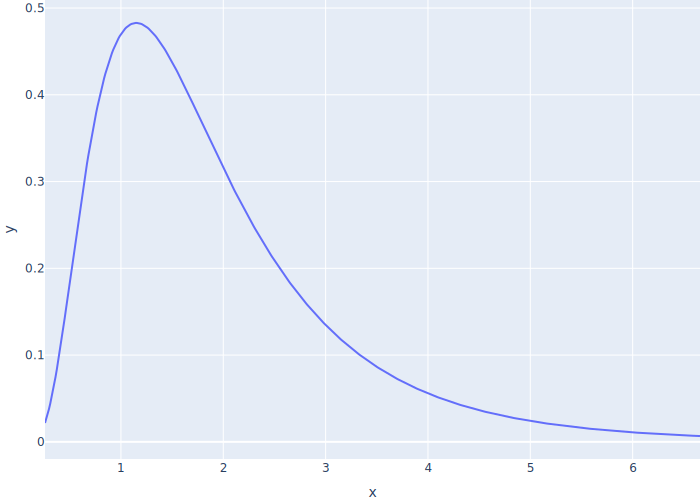

# Probabilistic Distributions

<p id="terms"></p>

## Uniform Rates

-   Use ranges for creation times and job durations

```{.py data-file=uniform_interaction.py}
RNG_SEED = 98765
T_CREATE = (6, 10)
T_JOB = (8, 12)
T_SIM = 20
```

-   `Job` has a random duration

```{.py data-file=uniform_interaction.py}
class Job:
    def __init__(self):
        self.id = next(Job._next_id)
        self.duration = random.uniform(*T_JOB)
```

-   `manager` waits a random time before creating the next job
    -   Format time to two decimal places for readability

```{.py data-file=uniform_interaction.py}
def manager(env, queue):
    while True:
        job = Job()
        print(f"manager creates {job} at {env.now:.2f}")
        yield queue.put(job)
        yield env.timeout(random.uniform(*T_CREATE))
```

-   Always initialize the random number generator to ensure reproducibility
    -   Hard to debug if the program behaves differently each time we run it

```{.py data-file=uniform_interaction.py}
if __name__ == "__main__":
    random.seed(RNG_SEED)
    # …as before…
```

<div class="row">
  <div class="col-5" markdown="1">
```{.txt data-file=uniform_interaction_manager.txt}
manager creates job-0 at 0.00
manager creates job-1 at 8.36
manager creates job-2 at 14.73
```
  </div>
  <div class="col-1">
  </div>
  <div class="col-5" markdown="1">
```{.txt data-file=uniform_interaction_coder.txt}
coder waits at 0.00
coder gets job-0 at 0.00
coder waits at 8.52
coder gets job-1 at 8.52
```
  </div>
</div>

## Better Random Distributions

-   Assume probability of manager generating a new job in any instant is fixed
    -   I.e., doesn't depend on how long since the last job was generated
-   If the arrival rate (jobs per tick) is λ,
    the time until the next job is an [exponential](g:random-exponential) random variable
    with mean 1/λ

<div class="center">
  
</div>

-   Use a [log-normal](g:random-log-normal) random variable to model job lengths
    -   All job lengths are positive
    -   Most jobs are short but there are a few outliers
    -   If parameters are μ and σ, the [median](g:median) is e<sup>μ</sup>

<div class="center">
  
</div>

## Better Random Interaction

-   Parameters and randomization functions

```{.py data-file=random_interaction.py}
…other parameters as before…
T_JOB_INTERVAL = 2.0
T_JOB_MEAN = 0.5
T_JOB_STD = 0.6

def rand_job_arrival():
    return random.expovariate(1.0 / T_JOB_INTERVAL)

def rand_job_duration():
    return random.lognormvariate(T_JOB_MEAN, T_JOB_STD)
```

-   Corresponding changes to `Job` and `manager`

```{.py data-file=random_interaction.py}
class Job:
    def __init__(self):
        self.id = next(Job._next_id)
        self.duration = rand_job_duration()

def manager(env, queue):
    while True:
        job = Job()
        t_delay = rand_job_arrival()
        print(f"manager creates {job} at {env.now:.2f} waits for {t_delay:.2f}")
        yield queue.put(job)
        yield env.timeout(t_delay)
```

-   Results

<div class="row">
  <div class="col-5" markdown="1">
```{.txt data-file=random_interaction_manager.txt}
manager creates job-0 at 0.00 waits for 7.96
manager creates job-1 at 7.96 waits for 0.60
manager creates job-2 at 8.56 waits for 3.70
```
  </div>
  <div class="col-1">
  </div>
  <div class="col-5" markdown="1">
```{.txt data-file=random_interaction_coder.txt}
coder waits at 0.00
coder gets job-0 at 0.00
coder waits at 0.65
coder gets job-1 at 7.96
coder waits at 8.75
coder gets job-2 at 8.75
```
  </div>
</div>

-   But this is still hard to read and analyze
