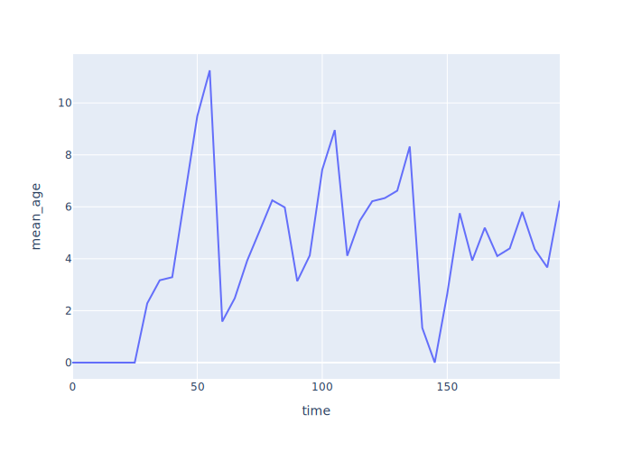
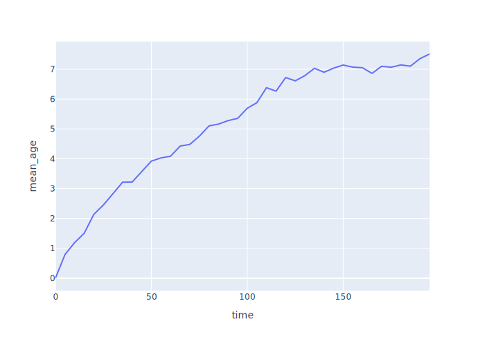

# Exploring Scenarios

<p id="terms"></p>

## Smoothing Over Multiple Runs

-   We have been showing results from individual runs
-   What do results look like when averaged over many runs?
-   Plot job ages vs. time averaged over 1, 10, 100, and 1000 simulations

<div class="row">
  <div class="col-6">
    <figure id="f:smoothing_ages_1">
      
      <figcaption>Ages From 1 Run</figcaption>
    </figure>
  </div>
  <div class="col-6">
    <figure id="f:smoothing_ages_10">
      
      <figcaption>Ages Smoothed Over 10 Runs</figcaption>
    </figure>
  </div>
</div>
<div class="row">
  <div class="col-6">
    <figure id="f:smoothing_ages_100">
      
      <figcaption>Ages Smoothed Over 100 Runs</figcaption>
    </figure>
  </div>
  <div class="col-6">
    <figure id="f:smoothing_ages_1000">
      
      <figcaption>Ages Smoothed Over 1000 Runs</figcaption>
    </figure>
  </div>
</div>

-   Work is piling up
    -   Toward an asymptote or just slowing down?
-   We only get to experience one curve in real life

## Choosing Jobs

-   Four policies:
    -   Oldest job first (same as regular queue)
    -   Newest job first
    -   Longest job first
    -   Shortest job first
-   Implement by:
    -   Replacing `Store` with `PriorityStore`
    -   Adding `__lt__` to `Job` for comparison
    -   Actual comparison depends on policy

```{.py data-file=job_priority.py}
class Params:
    # …as before…
    policy: str = "shortest"

class Job(Recorder):
    # …as before…
    def __lt__(self, other):
        match self.sim.params.policy:
            case "oldest":
                return self.t_create < other.t_create
            case "newest":
                return other.t_create < self.t_create
            case "shortest":
                return self.duration < other.duration
            case "longest":
                return other.duration < self.duration
            case _:
                assert False, f"unknown policy {self.sim.params.policy}"
```

-   Look at effect on backlog over time

<figure id="f:job_priority_backlog">
  
  <figcaption>Job backlog vs. time</figcaption>
</figure>

<figure id="f:job_priority_ages">
  
  <figcaption>Age of jobs in queue vs. time</figcaption>
</figure>

<div class="row" markdown="1">
<div class="col-6" markdown="1">
<div id="t:job_priority_throughput" data-caption="Throughput" markdown="1">

| policy   | t_sim | num_jobs | throughput |
|----------|-------|----------|------------|
| longest  | 1000  | 485      | 0.48       |
| newest   | 1000  | 457      | 0.46       |
| oldest   | 1000  | 497      | 0.5        |
| shortest | 1000  | 509      | 0.51       |

</div>
</div>
<div class="col-6" markdown="1">
<div id="t:job_priority_utilization" data-caption="Utilization" markdown="1">

| policy   | t_sim | total_work | utilization |
|----------|-------|------------|-------------|
| oldest   | 1000  | 934.48     | 0.93        |
| shortest | 1000  | 961.69     | 0.96        |
| newest   | 1000  | 888.03     | 0.89        |
| longest  | 1000  | 974.04     | 0.97        |

</div>
</div>
</div>

## Multiple Workers Redoing Work

-   Our models so far have assumed that when a job is done, it's done
-   In real life, testing often reveals bugs that need rework
-   Start by modeling with a second queue and a group of testers

```{.py data-file=rework_any.py}
class Params:
    # …as before…
    n_tester: int = 1
    p_rework: float = 0.5

class Simulation(Environment):
    def __init__(self):
        # …as before…
        self.test_queue = None

    def simulate(self):
        # …as before…
        self.test_queue = Store(self)
        for _ in range(self.params.n_tester):
            self.process(Tester(self).run())

class Tester(Recorder):
    def __init__(self, sim):
        super().__init__(sim)
        self.t_work = 0

    def run(self):
        while True:
            job = yield self.sim.test_queue.get()
            yield self.sim.timeout(job.duration)
            if self.sim.rand_rework():
                yield self.sim.code_queue.put(job)
            else:
                job.t_complete = self.sim.now
```

-   Any tester can test any job
-   All jobs needing rework go back in the same queue as new work
    -   And are handled in arrival order, i.e., not given priority
-   But this isn't realistic
-   Give each `Coder` its own queue

```{.py data-file=rework_same.py}
class Coder(Recorder):
    def __init__(self, sim):
        # …as before…
        self.queue = Store(self.sim)
```

-   Have testers give work back to the coder who did the work
    -   Need to add a `coder_id` field to jobs to keep track of this

```{.py data-file=rework_same.py}
class Tester(Recorder):
    def run(self):
        while True:
            job = yield self.sim.test_queue.get()
            assert job.coder_id is not None
            yield self.sim.timeout(job.duration)
            if self.sim.rand_rework():
                yield self.sim.coders[job.coder_id].queue.put(job)
            else:
                job.t_complete = self.sim.now
```

-   Now the hard part: coders selecting jobs
-   Put it in a method of its own
-   And use `yield from` to yield its results back to SimPy

```{.py data-file=rework_same.py}
class Coder(Recorder):
    def run(self):
        while True:
            job = yield from self.get()
            yield self.sim.timeout(job.duration)
            yield self.sim.test_queue.put(job)
```

-   So how does `Coder.get(…)` work?
    -   Create *but do not immediately `yield`* a request for an item from each queue
    -   `yield` the combination of those items using `|` (a short form for `simpy.AnyOf`)
    -   `result` is dictionary-like object whose keys are the requests
        and whose values are the items that we got
    -   If we got something from our own queue, take that
    -   If not, take what we got from the shared queue
-   Important: we have to cancel the other request or we can't make another one from that queue
    -   Yes, this took a while to figure out
    -   And yes, it's safe to cancel a request that wasn't satisfied

```{.py data-file=rework_same.py}
    def get(self):
        new_req = self.sim.code_queue.get()
        rework_req = self.queue.get()
        result = yield (new_req | rework_req)
        if (len(result.events) == 2) or (rework_req in result):
            new_req.cancel()
            job = result[rework_req]
            assert job.coder_id == self.id
        else:
            rework_req.cancel()
            job = result[new_req]
            assert job.coder_id is None
            job.coder_id = self.id
        return job
```

-   We can now build a graph showing the [transition probabilities](g:transition-probability)
    for each state that a job might be in
    -   Introduce a state `incomplete` for jobs that aren't finished by the end of the simulation

<figure id="f:rework_same">
  
  <figcaption>Transition Probability Graph</figcaption>
</figure>
