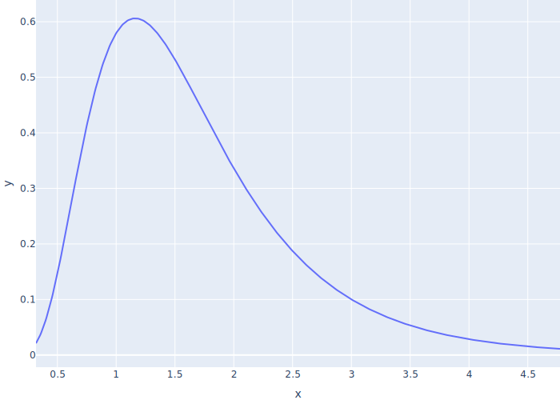

# Teams

-   Assume probability of manager generating a new job in any instant is fixed
    -   I.e., doesn't depend on how long since the last job was generated
-   If the arrival rate (jobs per tick) is λ,
    the time until the next job is an [exponential](g:random-exponential) random variable
    with mean 1/λ

<div class="center">
  
</div>

-   Use a [log-normal](g:random-log-normal) random variable to model job lengths
    -   Most jobs are short but there are a few outliers
    -   If parameters are μ and σ, [median](g:median) is e<sup>μ</sup>

<div class="center">
  
</div>

## One Manager with Multiple Programmers

-   Store all our parameters in a dictionary

```{.python data-file=multiple_programmers.py}
PARAMS = {
    "n_programmer": 3,
    "seed": 12345,
    "t_develop_mu": 0.4,
    "t_develop_sigma": 0.5,
    "t_job_arrival": 1.0,
    "t_sim": 10,
}
```

-   Create a `Simulation` class to hold all our odds and ends

```{.python data-file=multiple_programmers.py}
class Simulation:
    def __init__(self, params):
        self.params = params
        self.env = Environment()
        self.queue = Store(self.env)

    def rand_job_arrival(self):
        return random.expovariate(1.0 / self.params["t_job_arrival"])

    def rand_develop(self):
        return random.lognormvariate(
            self.params["t_develop_mu"], self.params["t_develop_sigma"]
        )
```

-   Create a `Job` class to store details of jobs
    -   And teach it how to convert itself to a dictionary for JSON output

```{.python data-file=multiple_programmers.py}
class Job:
    SAVE = ("id", "t_develop", "t_create", "t_start", "t_end", "worker_id")
    _id = count()
    _all = []

    def __init__(self, sim):
        Job._all.append(self)
        self.sim = sim
        self.id = next(Job._id)
        self.t_develop = sim.rand_develop()
        self.t_create = sim.env.now
        self.t_start = None
        self.t_end = None
        self.worker_id = None

    def as_json(self):
        return {key: rv(getattr(self, key)) for key in Job.SAVE}
```

-   `Manager` creates jobs at random intervals

```{.python data-file=multiple_programmers.py}
def manager(sim):
    while True:
        yield sim.queue.put(Job(sim))
        yield sim.env.timeout(sim.rand_job_arrival())
```

-   `Programmer` does jobs and bookkeeping

```{.python data-file=multiple_programmers.py}
def programmer(sim, worker_id):
    while True:
        job = yield sim.queue.get()
        job.t_start = sim.env.now
        job.worker_id = worker_id
        yield sim.env.timeout(job.t_develop)
        job.t_end = sim.env.now
```

-   Main driver sets things up, runs the simulation, and saves the parameters and job details

```{.python data-file=multiple_programmers.py}
def main():
    params = get_params()
    random.seed(params["seed"])

    sim = Simulation(params)

    sim.env.process(manager(sim))
    for i in range(params["n_programmer"]):
        sim.env.process(programmer(sim, i))
    sim.env.run(until=params["t_sim"])

    result = {
        "params": params,
        "jobs": [job.as_json() for job in Job._all],
    }
    json.dump(result, sys.stdout, indent=2)
```

-   Output

```{.python data-file=multiple_programmers.json}
{
  "params": {
    "n_programmer": 3,
    "seed": 12345,
    "t_develop_mu": 0.4,
    "t_develop_sigma": 0.5,
    "t_job_arrival": 1.0,
    "t_sim": 10
  },
  "jobs": [
    {
      "id": 0,
      "t_develop": 1.388,
      "t_create": 0,
      "t_start": 0,
      "t_end": 1.388,
      "worker_id": 0
    },
    …other jobs…
    {
      "id": 9,
      "t_develop": 3.267,
      "t_create": 9.995,
      "t_start": 9.995,
      "t_end": null,
      "worker_id": 1
    }
  ]
}
```
